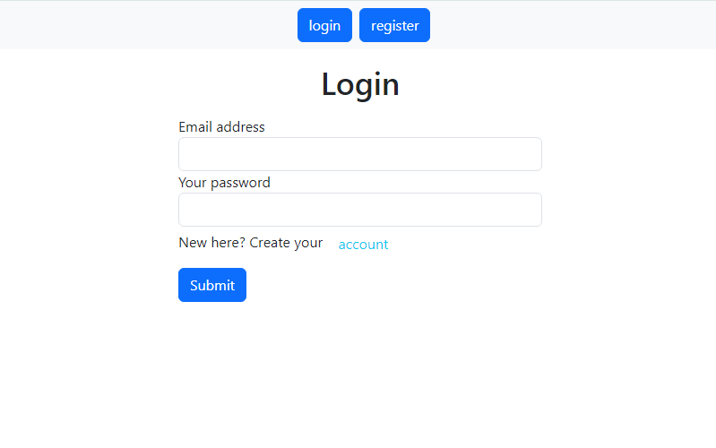
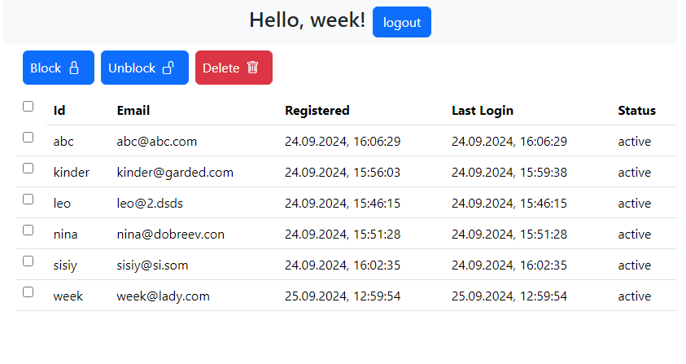

<a name="readme-top"></a>

<div align="center">
  <h1 align="center">Task 4</h1>
   
   

</div>

<!-- TABLE OF CONTENTS -->
<details>
  <summary>Table of Contents</summary>
  <ol>
    <li>
      <a href="#about-the-project">About The Project</a>
      <ul>
        <li><a href="#technology-stack">Technology stack</a></li>
      </ul>
    </li>
    </li>

  </ol>
</details>

<!-- ABOUT THE PROJECT -->

## About The Project

_Completed: September 2024_

For this and other tasks you can check out the [MindMap](https://miro.com/app/board/uXjVKXt043k=/?share_link_id=575629632634).

Deployment: [here](https://manage-users-task-4.netlify.app/)

Here is the [video demonstration](https://youtu.be/On0EyB6epoo) of the result.

### Task description

 **NOTE** As I used Firebase - some technical requirements are not fully completed. E.g. deleting user is possible only for authorised user (so you can delete yourself, not others).

JavaScript or TypeScript, React
(you can use anything to store data, for example, a backend on Node.js+Express+MySQL, or SaaS services like Firebase – note that there may be nuances with deleting "built-in users").

Implement a web application that allows users to register and authenticate. Unauthenticated users do not have access to user management (they only have access to the registration or authentication forms).
Only authenticated users can see the **users table** (with identifier, name, email, registration date, last login date, and status) containing users.

The table should have **checkboxes in the leftmost column** for multiple selections, with only a checkbox in the header (no text), allowing the user to select or deselect all entries.

Above the table, there should be a **toolbar** with actions: Block, Unblock, Delete (the last two can and should be represented as icons). The table, multiple selection, and toolbar are mandatory.

Each user can delete or block themselves or another user.

If someone else blocks or deletes a user, the next time that user makes any request, they should be redirected to the login page.

**During registration, it should be possible to use any password, even a single character.** If you're using a ready-made service to store users, you can either 1) implement your own "users" or 2) accept that some requirements cannot be fulfilled (but you'll get results faster).

A blocked user cannot log in, while a deleted user can re-register.

YOU MUST CREATE A UNIQUE INDEX IN YOUR DATABASE. DO NOT CHECK FOR UNIQUENESS IN CODE, CREATE AN INDEX.

It's mandatory to use a **CSS framework** (recommendation: Bootstrap, but any other is acceptable).

---

Why are all users admins, isn't that strange? Yes, it is a bit unusual; this wouldn't happen in real life. There are two reasons for this:

1) To simplify testing.
2) To simplify your work, so you don't have to deal with roles (for this task).

However, the ability to delete oneself is quite realistic, as it’s often required.

### Technology stack

[![NPM][NPM]][NPM-url]

[![HTML5][HTML5]][HTML5-url]

[![Javascript][Javascript]][Javascript-url]


[![Netlify][Netlify]][Netlify-url]

[![Bootstrap][Bootstrap]][Bootstrap-url]

<p align="right">(<a href="#readme-top">back to top</a>)</p>

## Getting Started

1. Clone the repo

   ```txt
   git clone <https://github.com/KateGoncharik/Itransition-studiyng.git>
   ```

2. Install NPM packages

   ```txt
   npm install
   ```

3. Run live-server. Or check out the deployment [here](https://manage-users-task-4.netlify.app/).

<p align="right">(<a href="#readme-top">back to top</a>)</p>

[NPM]: https://img.shields.io/badge/NPM-%23CB3837.svg?style=for-the-badge&logo=npm&logoColor=white
[NPM-url]: https://www.npmjs.com
[Javascript]: https://img.shields.io/badge/JavaScript-323330?style=for-the-badge&logo=javascript&logoColor=F7DF1E
[Javascript-url]: https://developer.mozilla.org/en-US/docs/Learn/JavaScript/First_steps/What_is_JavaScript
[HTML5]: https://img.shields.io/badge/html5-%23E34F26.svg?style=for-the-badge&logo=html5&logoColor=white
[HTML5-url]: https://html.com/html5/
[Netlify]: https://img.shields.io/badge/netlify-%23000000.svg?style=for-the-badge&logo=netlify&logoColor=#00C7B7
[Netlify-url]: https://www.netlify.com/
[Bootstrap]: https://img.shields.io/badge/Bootstrap-563D7C?style=for-the-badge&logo=bootstrap&logoColor=white
[Bootstrap-url]: https://getbootstrap.com/
