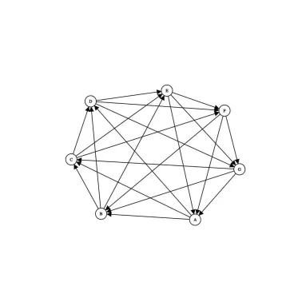
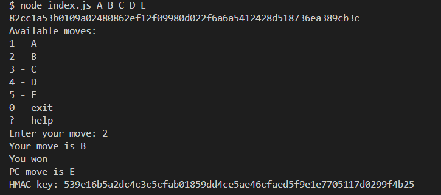

<a name="readme-top"></a>

<div align="center">
  <h1 align="center">Task 3</h1>
</div>

<!-- TABLE OF CONTENTS -->
<details>
  <summary>Table of Contents</summary>
  <ol>
    <li>
      <a href="#about-the-project">About The Project</a>
      <ul>
        <li><a href="#technology-stack">Technology stack</a></li>
      </ul>
    </li>
    </li>

  </ol>
</details>

<!-- ABOUT THE PROJECT -->

## About The Project

_Completed: September 2024_





For this and other tasks you can check out the [MindMap](https://miro.com/app/board/uXjVKXt043k=/).

Here is the [video demonstration](https://www.youtube.com/watch?v=T7nIC433wkY) of the game.

### Task description

1. The player wants to play a general non-transitive game with a single move. Not rock-paper-scissors, but _any_ custom game they come up with. The main feature is non-transitivity of moves (the second move beats the first, the third beats the second, but the third loses to the first if there are 3 moves). Therefore, the specific moves cannot be hardcoded in the game logic—they are passed as arguments.

2. The rules are defined solely by the order of the moves, not their semantics. If the player wants to change the rules, they change the order of the moves passed to the game.

3. The number of moves can be arbitrary (an odd number greater than 1)—as the number of moves increases, the probability of a tie approaches zero.

4. The player wants proof that the computer did not change its move after the player's move. At the same time, the player wants the game to remain "interesting"—meaning the player should not know or be able to calculate the computer's move before making their own.

### Technology stack

[![NPM][NPM]][NPM-url]

[![Javascript][Javascript]][Javascript-url]

[![Node-js][Node-js]][Node-js-url]

<p align="right">(<a href="#readme-top">back to top</a>)</p>

## Getting Started

1. Clone the repo

   ```txt
   git clone <https://github.com/KateGoncharik/Itransition-studiyng.git>
   ```

2. Install NPM packages

   ```txt
   npm install
   ```

3. Run game (with any arguments instead of 'A B C')

   ```txt
   node index.js A B C
   ```

<p align="right">(<a href="#readme-top">back to top</a>)</p>

[NPM]: https://img.shields.io/badge/NPM-%23CB3837.svg?style=for-the-badge&logo=npm&logoColor=white
[NPM-url]: https://www.npmjs.com
[Javascript]: https://img.shields.io/badge/JavaScript-323330?style=for-the-badge&logo=javascript&logoColor=F7DF1E
[Javascript-url]: https://developer.mozilla.org/en-US/docs/Learn/JavaScript/First_steps/What_is_JavaScript
[Node-js]: https://img.shields.io/badge/Node%20js-339933?style=for-the-badge&logo=nodedotjs&logoColor=white
[Node-js-url]: https://nodejs.org/en
