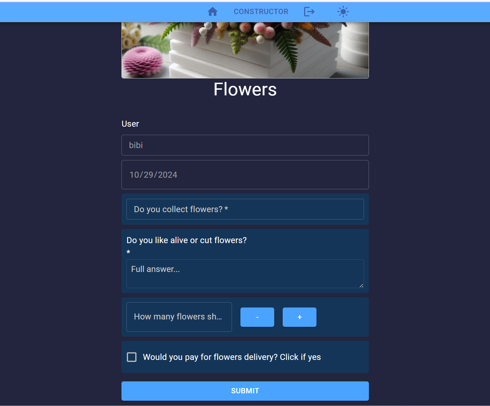

<a name="readme-top"></a>

<div align="center">
<a href="https://kate-forms-final-task.netlify.app/">
  
  
  
  

</a>
  <h1 align="center">Final task</h1>

</div>

<!-- TABLE OF CONTENTS -->
<details>
  <summary>Table of Contents</summary>
  <ol>
    <li>
      <a href="#about-the-project">About The Project</a>
      <ul>
        <li><a href="#technology-stack">Technology stack</a></li>
      </ul>
    </li>
    </li>

  </ol>
</details>

<!-- ABOUT THE PROJECT -->

## About The Project

_Completed: 2024_

- For this and other tasks you can check out the [MindMap](https://miro.com/app/board/uXjVKXt043k=/?share_link_id=575629632634).

- Deployment: [here](https://kate-forms-final-task.netlify.app/)

- Here is the [video demonstration](h) of the result.

### Task description

You have to implement a Web application for customisable forms (quizzes, tests, questionnaires, polls, etc.). Something similar to Google Forms.
Users define "_templates_" (the set of questions, their names and descriptions, etc.), and other users fill out "forms" (their specific answers) using these templates (e.g., enter or select values in the fields).

E.g., I create a template with one integer-valued question "How many apples do you eat per day?" Users fill out corresponding forms, and I can analyse the answers.

Filled-out forms (answers) can be seen by the author as well as the creator of the responding template and admins. Templates are accessible for viewing for everyone.

Every user has its own personal page where they can manage the sortable table of templates (create new, delete, or edit) and the sortable table of the filled forms (probably on two separate tabs).

More requirements can be found at [MindMap](https://miro.com/app/board/uXjVKXt043k=/?share_link_id=575629632634).

Main features (completed and in progress):

- [x] registration and authorization
- [] admin and user roles
- [] user profile
- [x] form templates creation
- [x] view created templates
- [x] forms filling
- [] viewing and editing answers
- [] comments, likes to forms
- [] drag'n'drop at template constructor
- [] markdown support at template constructor
- [] tags for filtering templates
- [x] themes (dark/light)
- [] full-text search
- [] internalization (2 languages)
- [x] adaptive layout


<div style="display: flex;">
  
||
  
</div>

### Technology stack

[![NPM][NPM]][NPM-url]

[![HTML5][HTML5]][HTML5-url]

[![Javascript][Javascript]][Javascript-url]

[![Netlify][Netlify]][Netlify-url]

<p align="right">(<a href="#readme-top">back to top</a>)</p>

## Getting Started

1. Clone the repo

   ```txt
   git clone <https://github.com/KateGoncharik/Itransition-studiyng.git>
   ```

2. Install NPM packages

   ```txt
   npm install
   ```

3. Run live-server. Or check out the deployment [here](https://kate-forms-final-task.netlify.app/).

<p align="right">(<a href="#readme-top">back to top</a>)</p>

[NPM]: https://img.shields.io/badge/NPM-%23CB3837.svg?style=for-the-badge&logo=npm&logoColor=white
[NPM-url]: https://www.npmjs.com
[Javascript]: https://img.shields.io/badge/JavaScript-323330?style=for-the-badge&logo=javascript&logoColor=F7DF1E
[Javascript-url]: https://developer.mozilla.org/en-US/docs/Learn/JavaScript/First_steps/What_is_JavaScript
[HTML5]: https://img.shields.io/badge/html5-%23E34F26.svg?style=for-the-badge&logo=html5&logoColor=white
[HTML5-url]: https://html.com/html5/
[Netlify]: https://img.shields.io/badge/netlify-%23000000.svg?style=for-the-badge&logo=netlify&logoColor=#00C7B7
[Netlify-url]: https://www.netlify.com/
