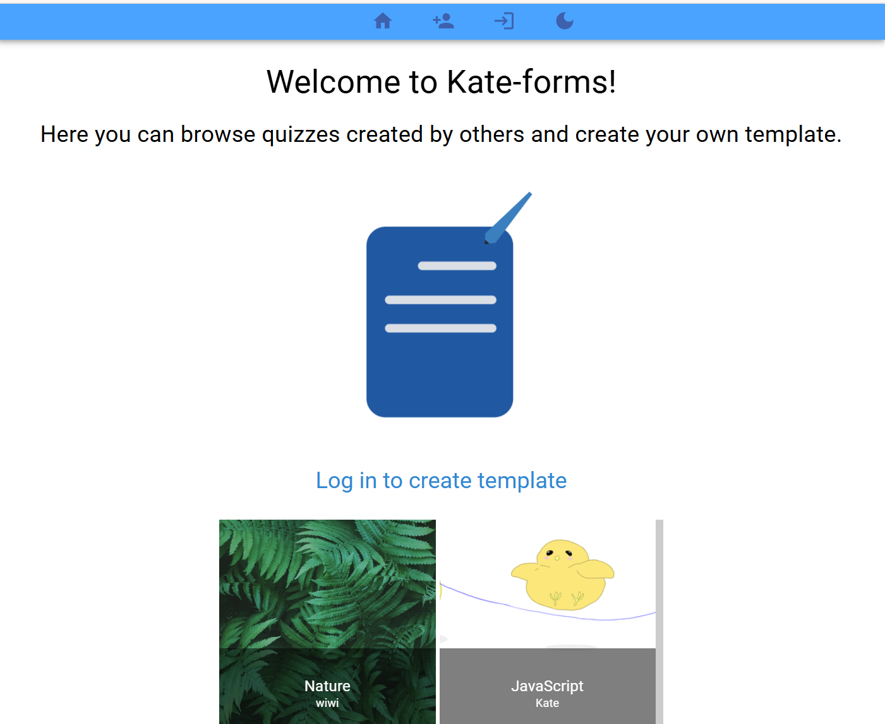
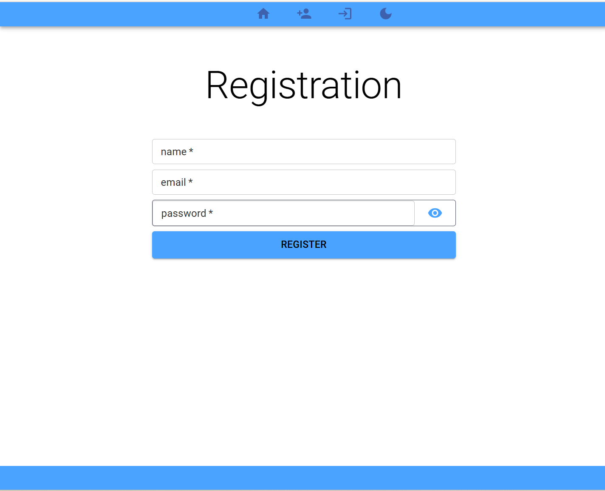
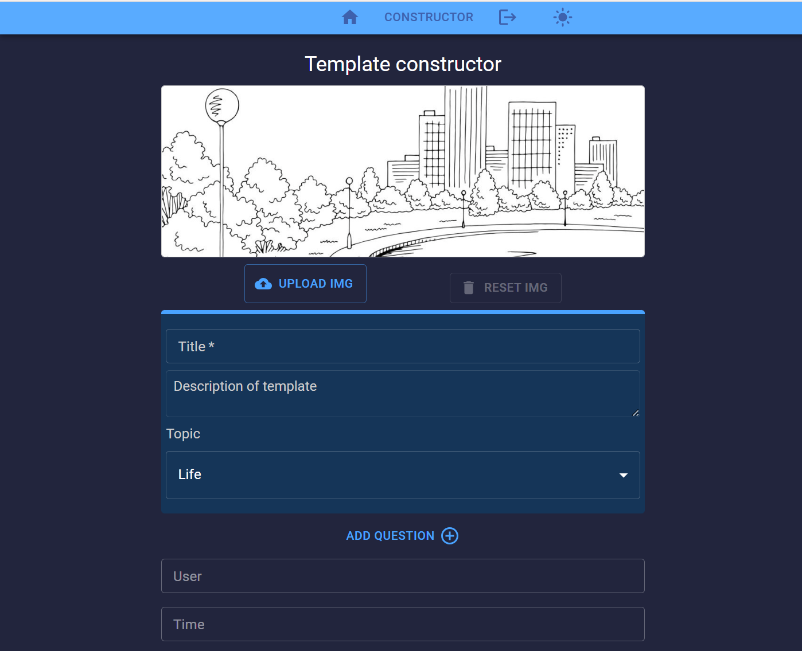
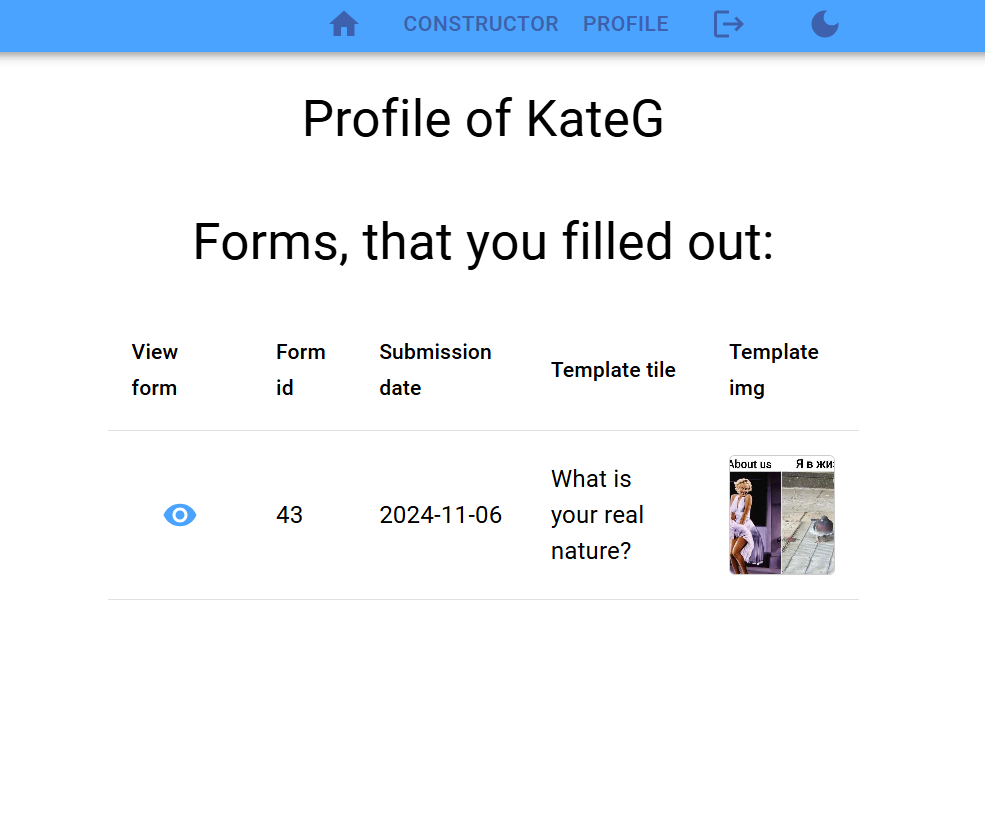
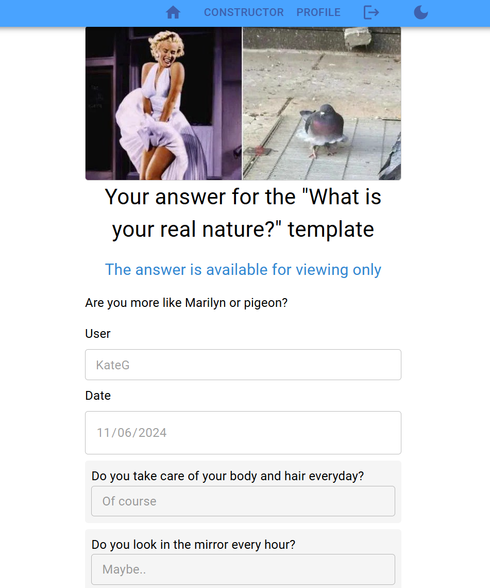
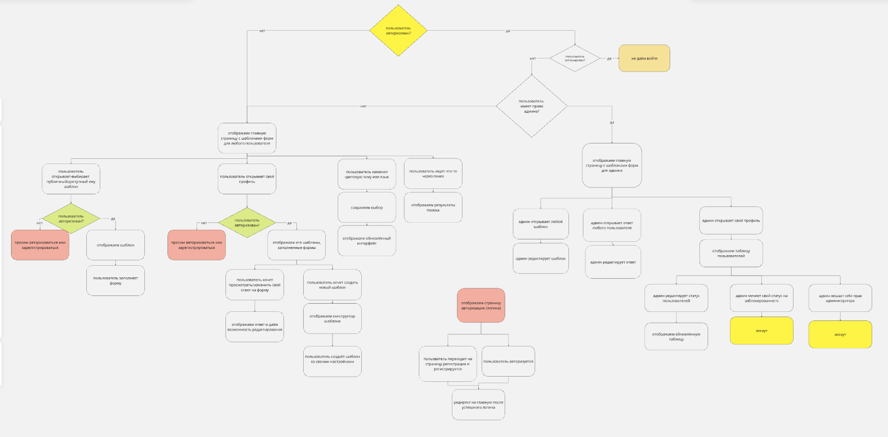
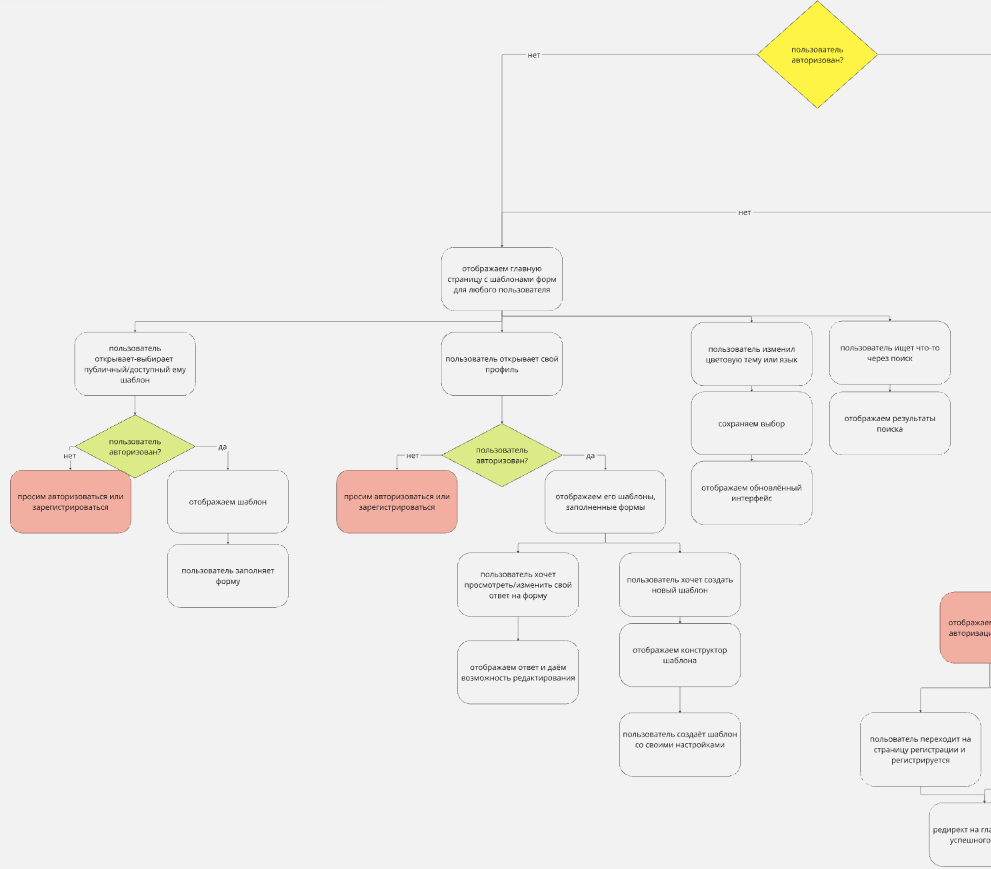
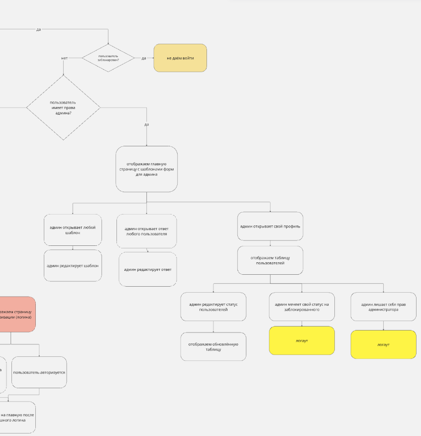

<a name="readme-top"></a>

<div align="center">
<a href="https://kate-forms-final-task.netlify.app/">
  
  
  
  
  

</a>
  <h1 align="center">Final task</h1>

</div>

<!-- TABLE OF CONTENTS -->
<details>
  <summary>Table of Contents</summary>
  <ol>
    <li>
      <a href="#about-the-project">About The Project</a>
      <ul>
        <li><a href="#technology-stack">Technology stack</a></li>
      </ul>
    </li>
    </li>

  </ol>
</details>

<!-- ABOUT THE PROJECT -->

## About The Project

_Completed: November 2024_

- For this and other tasks you can check out the [MindMap](https://miro.com/app/board/uXjVKXt043k=/?share_link_id=575629632634).

- Deployment: [here](https://kate-forms-final-task.netlify.app)

VIDEO WILL BE UPDATED AFTER ADMIN PAGE COMPLETION

- Here is the [video demonstration](https://www.youtube.com/watch?v=XUAySelb4WU) of the result.

### Task description

You have to implement a Web application for customizable forms (quizzes, tests, questionnaires, polls, etc.). Something similar to Google Forms.
Users define "_templates_" (the set of questions, their names and descriptions, etc.), and other users fill out "forms" (their specific answers) using these templates (e.g., enter or select values in the fields).

E.g., I create a template with one integer-valued question "How many apples do you eat per day?" Users fill out corresponding forms, and I can analyze the answers.

Filled-out forms (answers) can be seen by the author as well as the creator of the responding template and admins. Templates are accessible for viewing for everyone.

Every user has its own personal page where they can manage the sortable table of templates (create new, delete, or edit) and the sortable table of the filled forms (probably on two separate tabs).

More requirements can be found at [MindMap](https://miro.com/app/board/uXjVKXt043k=/?share_link_id=575629632634).

Main features (completed and in progress):

- [x] registration and authorization
- [] admin and user roles
- [x] user profile
  - [x] view table with answers (forms)
  - [] view table with created templates
  - [] make sort in tables
  - [] allow managing templates from profile
  - [] allow managing answers(forms) from profile
- [x] admin page
  - [x] view all templates, forms and users data
  - [] paginate, sort, search through templates, forms and users data
  - [] control roles in app
  - [] edit templates, forms, users data
  - [] set or remove role of any user
- [x] form templates creation
- [x] view all created templates
- [x] forms filling
- [] editing answers
- [] comments, likes to forms
- [] drag'n'drop at template constructor
- [] markdown support at template constructor
- [] tags for filtering templates
- [x] themes (dark/light)
- [] full-text search
- [] internalization (2 languages)
- [x] adaptive layout

## Scheme for all possible user actions in app

  

<div style="display: flex;">
  
||
  
</div>

## API overview

Available endpoints:

Users:

- GET /users - returns a list of all users
- GET /users/:id - returns a user by id
- GET /users/:id/forms - returns all forms of particular user

Templates:

- GET /templates -> returns a list of all templates
- GET /templates/:id -> returns a template by id

Forms:

- GET /forms - returns a list of all forms
- GET /forms/:id - returns a form by id

### Technology stack

[![NPM][NPM]][NPM-url]

Main technologies:

[![HTML5][HTML5]][HTML5-url]

[![Javascript][Javascript]][Javascript-url]

[![TypeScript][TypeScript]][TypeScript-url]

[![NodeJS][NodeJS]][NodeJS-url]

[![React][React]][React-url]

[![React-router][React-router]][React-router-url]

[![React-admin][React-admin]][React-admin-url]

Styled components:

[![Mui][Mui]][Mui-url]

Token:

[![JWT][JWT]][JWT-url]

Data validation:

[![Zod][Zod]][Zod-url]

Linters and formatters:

[![Prettier][Prettier]][Prettier-url]

[![Stylelint][Stylelint]][Stylelint-url]

[![Lint-staged][Lint-staged]][Lint-staged-url]

[![Husky][Husky]][Husky-url]

[![Eslint][Eslint]][Eslint-url]

Deployment hostings:

[![Netlify][Netlify]][Netlify-url]
[![Render][Render]][Render-url]

<p align="right">(<a href="#readme-top">back to top</a>)</p>

## Getting Started

1. Clone the repo

   ```txt
   git clone <https://github.com/KateGoncharik/Itransition-studiyng.git>
   ```

2. Install NPM packages

   ```txt
   npm install
   ```

3. Run live-server. Or check out the deployment [here](https://kate-forms-final-task.netlify.app/).

<p align="right">(<a href="#readme-top">back to top</a>)</p>

[JWT]: ./public/jwt-logo.jpeg
[JWT-url]: https://jwt.io/
[React-admin]: ./public/react-admin.png
[React-admin-url]: https://marmelab.com/react-admin/
[Render]: https://img.shields.io/badge/Render-46E3B7?style=for-the-badge&logo=render&logoColor=white
[Render-url]: https://dashboard.render.com/
[Husky]: ./public/husky.png
[Husky-url]: https://typicode.github.io/husky/
[Lint-staged]: ./public/lint-staged.png
[Lint-staged-url]: https://npmjs.com/package/lint-staged/v/12.3.2
[Eslint]: https://img.shields.io/badge/eslint-3A33D1?style=for-the-badge&logo=eslint&logoColor=white
[Eslint-url]: https://eslint.org/
[Prettier]: https://img.shields.io/badge/prettier-1A2C34?style=for-the-badge&logo=prettier&logoColor=F7BA3E
[Prettier-url]: https://prettier.io/
[Stylelint]: https://img.shields.io/badge/stylelint-000?style=for-the-badge&logo=stylelint&logoColor=white
[Stylelint-url]: https://stylelint.io/
[Zod]: https://img.shields.io/badge/-Zod-3E67B1?style=flat&logo=zod&logoColor=white
[Zod-url]: https://zod.dev/
[React-router]: https://img.shields.io/badge/React_Router-CA4245?style=for-the-badge&logo=react-router&logoColor=white
[React-router-url]: https://reactrouter.com/en/main
[TypeScript]: https://img.shields.io/badge/typescript-%23007ACC.svg?style=for-the-badge&logo=typescript&logoColor=white
[TypeScript-url]: https://www.typescriptlang.org
[Mui]: https://img.shields.io/badge/Material%20UI-007FFF?style=for-the-badge&logo=mui&logoColor=white
[Mui-url]: https://mui.com/
[React]: https://img.shields.io/badge/React-20232A?style=for-the-badge&logo=react&logoColor=61DAFB
[React-url]: https://https://react.dev/
[NPM]: https://img.shields.io/badge/NPM-%23CB3837.svg?style=for-the-badge&logo=npm&logoColor=white
[NPM-url]: https://www.npmjs.com
[Javascript]: https://img.shields.io/badge/JavaScript-323330?style=for-the-badge&logo=javascript&logoColor=F7DF1E
[Javascript-url]: https://developer.mozilla.org/en-US/docs/Learn/JavaScript/First_steps/What_is_JavaScript
[HTML5]: https://img.shields.io/badge/html5-%23E34F26.svg?style=for-the-badge&logo=html5&logoColor=white
[HTML5-url]: https://html.com/html5/
[Netlify]: https://img.shields.io/badge/netlify-%23000000.svg?style=for-the-badge&logo=netlify&logoColor=#00C7B7
[Netlify-url]: https://www.netlify.com/
[NodeJS]: https://img.shields.io/badge/Node%20js-339933?style=for-the-badge&logo=nodedotjs&logoColor=white
[NodeJS-url]: https://nodejs.org/en
